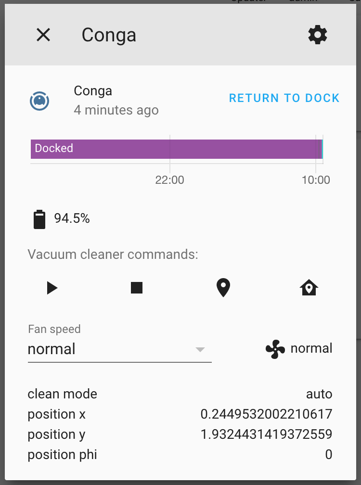
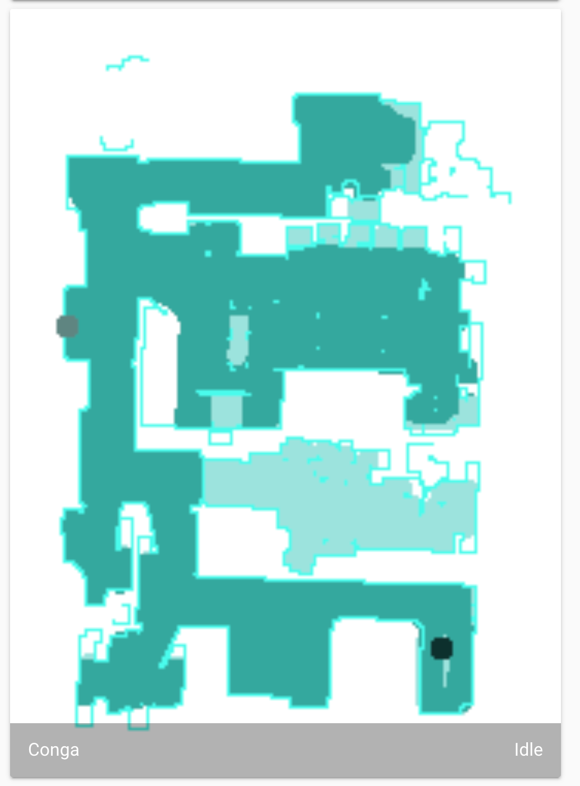

# badconga


Development has stopped in favor of [Valetudo](https://valetudo.cloud/) ([fork](https://github.com/adrigzr/Valetudo)).

Follow this [tutorial](https://gitlab.com/freeconga/stuff/-/blob/master/docs/install-valetudo.md) to install Valetudo with our fork.

Contact us at [Telegram](https://telegram.me/freeconga) | [GitLab Group](https://gitlab.com/freeconga).

---

Proof of concept plugin for Home Assistant for Cecotec Conga Vacuums.

Please report the "model" state attribute of vacuum.conga along with the Conga model if it is a simple number instead of a model name.

All data has been reverse-engineered from Android app [Conga 3000](https://play.google.com/store/apps/details?id=es.cecotec.s3590&hl=es).

Compatible models: Conga 3290, 3390, 3490, 3590, 3690, 3790 and 5090.

Currently tested on: Conga 3490 and 5090.

Please report other compatible models.

## Features

- [x] Vacuum entity



- [x] Camera entity



## Home Assistant

### Installation

#### HACS

- Add repository "https://github.com/adrigzr/badconga" to custom repositories and select "Integration" category.
- Click on "Install" in the plugin card.

#### Manual

Copy or link [`badconga`](./custom_components/badconga) subfolder to `config/custom_components`.

### Configuration

Create a new account on the app and link the device to it.

This integration does not support having the same account in the app and in Home Assistant at the same time. If you try to use the same account as in the app, things will not work correctly as soon as you open the app. Using different accounts in Home Assistant and in the app is supported. Home Assistant will pause controlling the robot and show its state as unknown while the app is in use. Home assistant will resume controlling the robot a few minutes after the app is closed.

```
badconga:
  email: 'email'
  password: 'password'

# enable debug for now...
logger:
  default: info
  logs:
    custom_components.badconga: debug
```

## Snippets

### Lint project

```
$ pylint --ignore=schema_pb2.py badconga
```

### Dump Android packets

```
$ adb shell
$ su
# tcpdump -i wlan0 -s0 -w - | nc -l -p 11111
```

### Listen for packets on host

```
$ adb forward tcp:11111 tcp:11111
$ nc localhost 11111 | tcpflow -o flow -r - "port 4020 or port 4030"
```

### Read app logs

```
$ adb logcat -c && adb logcat es.cecotec.s3590:V > flow.log
```

### Compile protobuf schemas

```
$ protoc --python_out=. app/schema.proto
```

### Parse flow

```
$ python3 parse.py flow/*~*.xml
```

### Inspect hex string as protobuf

```
$ git clone https://github.com/mildsunrise/protobuf-inspector.git
$ echo "<hex string>" | xxd -r -p | ./protobuf-inspector/main.py
```
